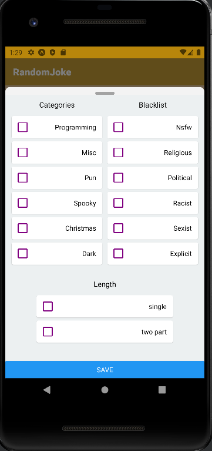
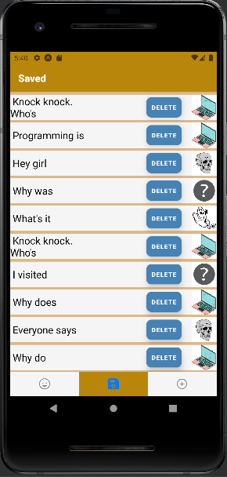

# JokeJoke App
Expo built React Native application where u can fetch jokes, save to sql database on your mobile device and send new joke requests to [JokeApi](https://sv443.net/jokeapi/v2/)

# Pages

 

----
# API
This program uses free [JokeApi](https://sv443.net/jokeapi/v2/) 
Using this program or visiting **JokeApi**  web you are agreeing on [PrivacyPolicy](https://sv443.net/privacypolicy/en) of **sv443.net/jokeapi**
