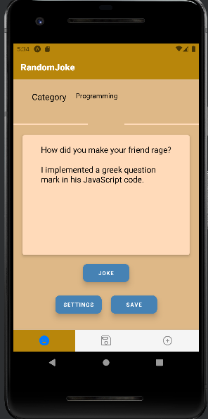

# JokeJoke App
Expo built React Native application for android where u can fetch jokes, save to sql database on your mobile device and create new jokes to be requested for publishing to [JokeApi](https://sv443.net/jokeapi/v2/)

Styling works best on normal smartphones,  scaling for such as **tablets** is not yet implemented

## API

This program uses public [JokeApi](https://sv443.net/jokeapi/v2/) 
Using this program or visiting **JokeApi**  web you are agreeing on [PrivacyPolicy](https://sv443.net/privacypolicy/en) of **sv443.net/jokeapi**

## How to use?

Download apk file for android from
[Android Build](https://expo.dev/accounts/wepukka/projects/joke_joke/builds/5970d09d-8536-4e0c-83e5-7c57c605cd98) *Does not work after 17th june 2022*

Test with [Expo](https://expo.dev/@wepukka/joke_joke) which can be downloaded from [Android Store](https://play.google.com/store/apps/details?id=host.exp.exponent&hl=fi&gl=US)

[Github Release](https://github.com/wepukka/JokeJoke/releases/tag/v1.0.0) contains both source code and apk.file for android

## Screens

 

