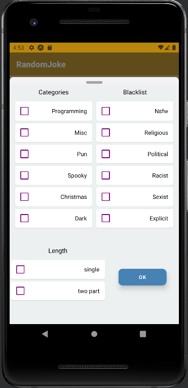

# JokeJoke App
Expo built React Native application where u can fetch jokes, save to sql database and send post requests to public API

# Current Progress
Setting sheet for fetch & jokes saved to SQL
#
 
#
